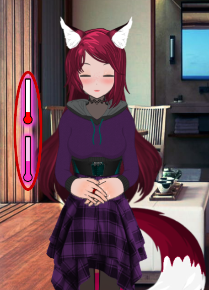
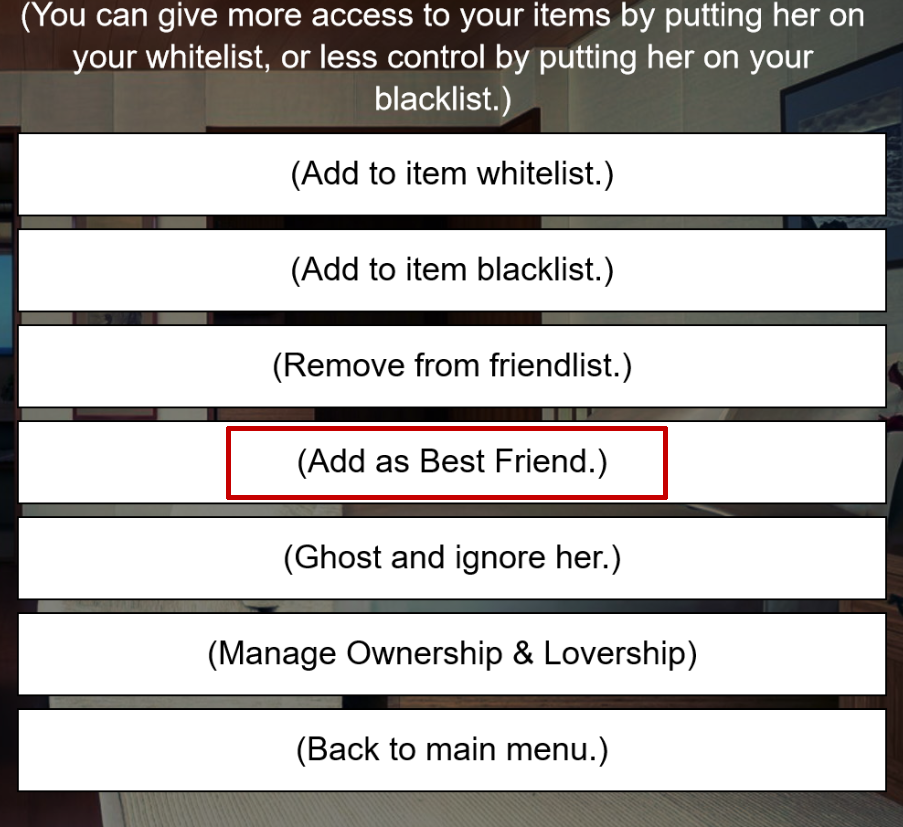
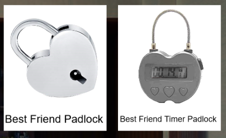

# BCTweaks
This repo is a collection of tweaks that might be useful for Bondage Club. Currently there are 2 main components. The bookmarklets serving as small scripts that you can use as buttons for BC and the BCTweaks extension.  
More infos on the bookmarklets are available in [`Bookmarklets`](bookmarklets).  

## Extension
The extension adds a few new features and tweaks to BC. For example splitting the arousal bar into two separate arousal and orgasm bars or wagging a tail when you write that in chat. The extension can be found under [`extension/bct.js`](extension/bct.js) and can easily be installed using Tampermonkey upon following this [link](https://github.com/agicitag/BCTweaks/raw/main/extension/bctLoader.user.js).  
It can also be loaded as a bookmark by pasting the following into the address bar of a bookmark:  
`javascript:(()=>{fetch('https://agicitag.github.io/BCTweaks/extension/bctLoader.user.js').then(r=>r.text()).then(r=>eval(r));})();`

### Beta
Theres also a beta version of BCTweaks available, giving you access to new features faster. The catch is that the beta versions may still contain gamebreaking bugs, so be aware of that if you want to use it. Bug reports are greatly appreciated.  
You can install the beta also with Tampermonkey upon following this [link](https://github.com/agicitag/BCTweaks/raw/main/extension/bctBetaLoader.user.js) or load it with the bookmark:  
`javascript:(()=>{fetch('https://agicitag.github.io/BCTweaks/extension/bctBetaLoader.user.js').then(r=>r.text()).then(r=>eval(r));})();`

## Mobile
To use BCT on mobile, simply create a bookmark and paste the same address for either the normal version or the beta version as described above. It doesn't work on Firefox.
#

## Features

Check out the BCTweaks settings in Preferences/Settings menu of Bondage Club.

- ### Split Arousal Bar

  Hate being horny from only cuddles or friendly kisses, and want these affectionate actions apply differently than sexual ones? OR the fact that you stutter just because someone touched you... Once. Then Split Arousal Bar will help you with that.
  
  
  
  This feature splits the normal BC arousal bar into two separate bars. The red one is the orgasm bar which only gets filled by actions on areas you have set in BC as "This zone can give you an orgasm". This bar can be seen by everyone, also those without the addon and is the one that affects the game (e.g. speech). The pink one is the arousal bar which is basically the same as the normal BC one, but cant make you orgasm.
 
- ### Tail Wagging 
  Set your tail to perform automated movement upon sending certain emotes such as "* wags her tail" or "* 's tail is wagging".
  
- ### Best Friends
  Get the benefits of being lovers without the restrictions of only being able to have 5 of them! This feature allows you to add someone as best friend.

  

  The benefits include knowing your best friends private rooms, just like you would for lovers. Pretty useful, like if your lovers list is full, or you want your submissives to know which private room you're in; like you would with them.

  
  
  Make your partners helpless by using best friend locks and best friend timer locks! A lock limited only to best friends and above in hierarchy. Non BCTweaks users would only be able to see it as a high-security padlock but would be impossible to pick.
